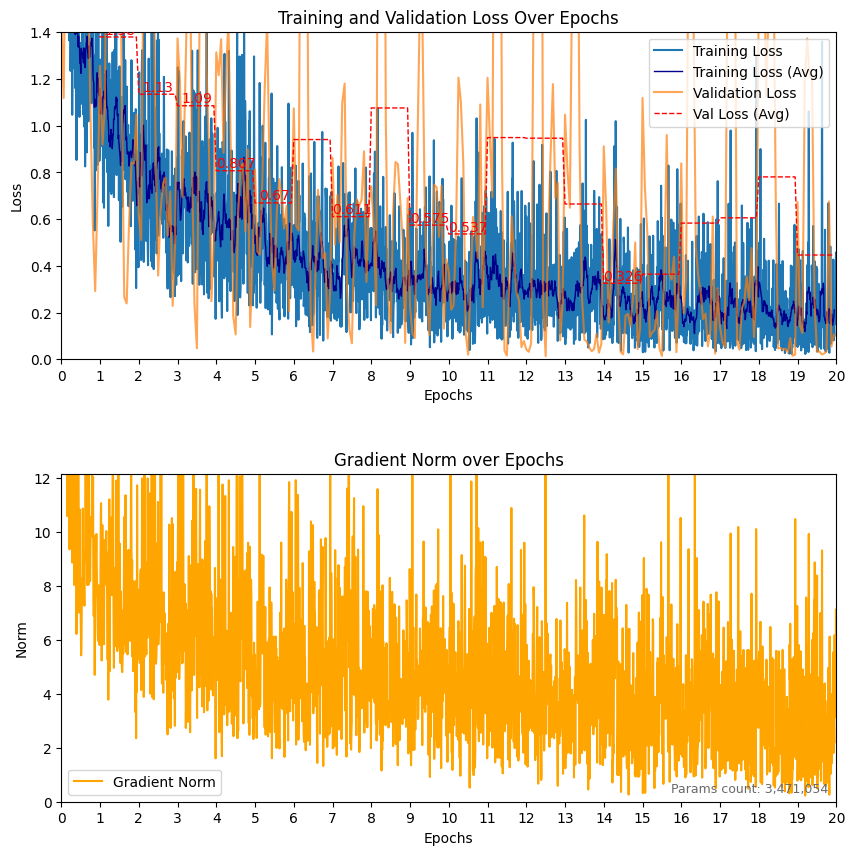
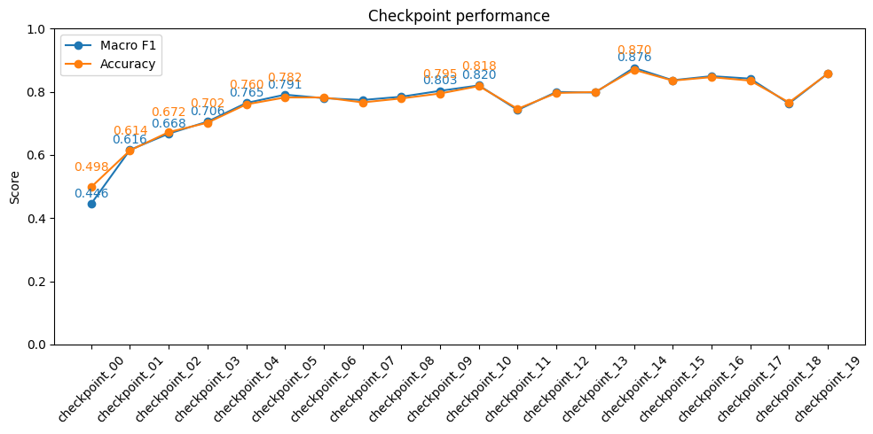
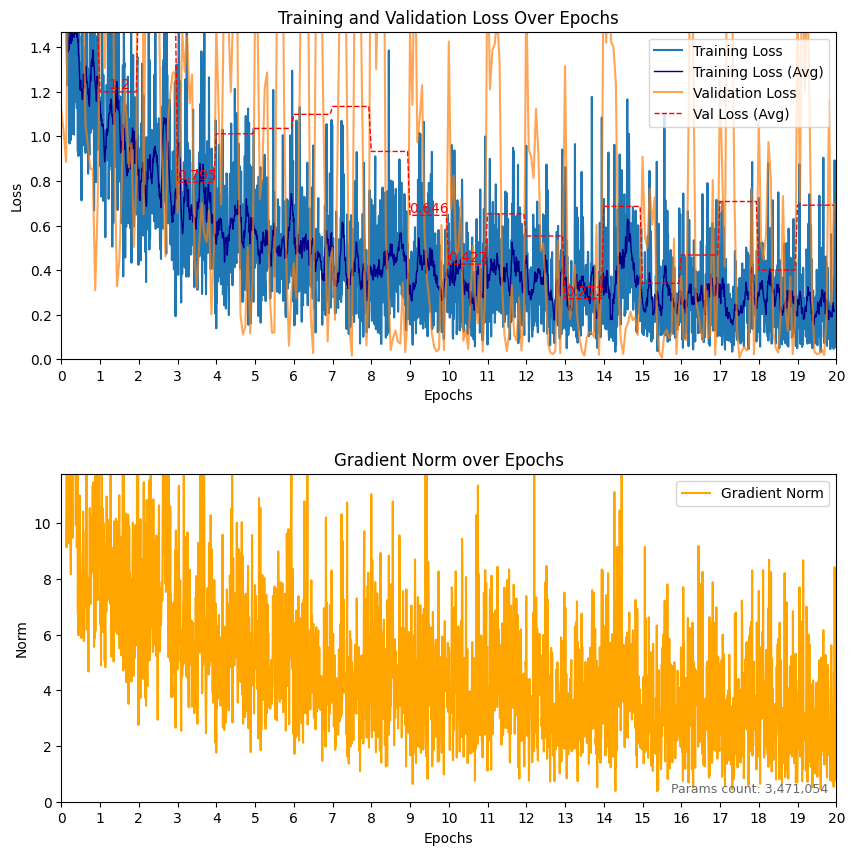
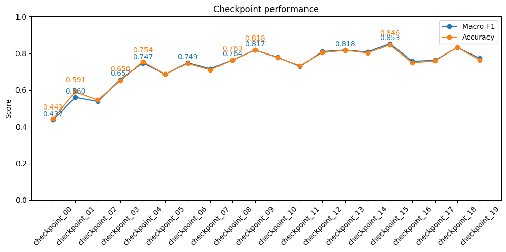

# radHAR with Pointnet: not very good, point density nto high enough
 -> with attention added acros the time dimension (60 frame per window), we get for the best checkpoint (number 9)
Macro F1: 0.4150 \
Accuracy: 0.4969 \
{'boxing': 0.15714286267757416, 'jack': 0.2916666567325592, 'jump': 0.6280193328857422, 'squats': 0.3707317113876343, 'walk': 0.627345860004425}

# modelNET with "only" 22 epochs and no data augmentation:
Macro F1: 0.7517 \
Accuracy: 0.8043 \
{'airplane': 0.9611650705337524, 'bathtub': 0.4166666567325592, 'bed': 0.8981481194496155, 'bench': 0.5555555820465088, 'bookshelf': 0.8651162981987, 'bottle': 0.9261083602905273, 'bowl': 0.8636363744735718, 'car': 0.9900000095367432, 'chair': 0.9599999785423279, 'cone': 0.8205128312110901, 'cup': 0.5, 'curtain': 0.8372092843055725, 'desk': 0.5199999809265137, 'door': 0.8999999761581421, 'dresser': 0.6153846383094788, 'flower_pot': 0.1111111119389534, 'glass_box': 0.969072163105011, 'guitar': 0.9312169551849365, 'keyboard': 0.8085106611251831, 'lamp': 0.6341463327407837, 'laptop': 0.9523809552192688, 'mantel': 0.964102566242218, 'monitor': 0.8247422575950623, 'night_stand': 0.675159215927124, 'person': 0.6222222447395325, 'piano': 0.8712871074676514, 'plant': 0.8118811845779419, 'radio': 0.5263158082962036, 'range_hood': 0.9528796076774597, 'sink': 0.75, 'sofa': 0.5921052694320679, 'stairs': 0.7234042286872864, 'stool': 0.6000000238418579, 'table': 0.5889570713043213, 'tent': 0.6800000071525574, 'toilet': 0.9797979593276978, 'tv_stand': 0.7446808218955994, 'vase': 0.7724867463111877, 'wardrobe': 0.6666666865348816, 'xbox': 0.6857143044471741}

questions to prof:
- why losses and scores dont seem to be related
- are my traning/testing losses a mess ?
- are my scores too high?

# radar pointNET V1 (no attention) with only the three positions and 20 epochs and NO data augmentation:
Macro F1: 0.8581 \
Accuracy: 0.8574 \
{'boxing': 0.8039867281913757, 'jack': 0.8625592589378357, 'jump': 0.7763713002204895, 'squats': 0.9416666626930237, 'walk': 0.9059233665466309} \
we even get for checkpoint 69: \
Macro F1: 0.9319 \
Accuracy: 0.9295 \
{'boxing': 0.9266409277915955, 'jack': 0.9743589758872986, 'jump': 0.8770492076873779, 'squats': 0.9873417615890503, 'walk': 0.8940397500991821}

# radar pointNET V1 with 3 positons, 20 epochs, AND data augmentaion

We observe similar best scores, but more chatoic training, I have added rotation and point jittering (on non zero points) with a  gaussian jitter of variance 0.02 \
Macro F1: 0.8533 \
Accuracy: 0.8464 \
{'boxing': 0.8311688303947449, 'jack': 0.9333333373069763, 'jump': 0.7712418437004089, 'squats': 0.9367088675498962, 'walk': 0.7942238450050354}

