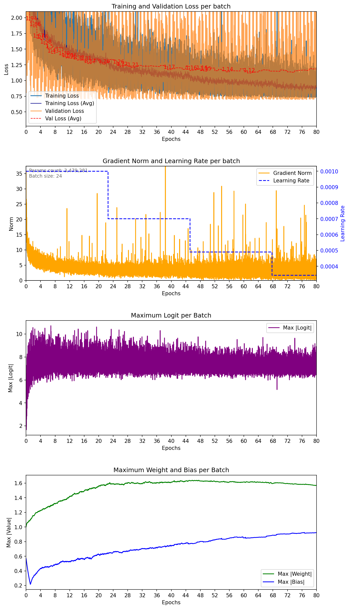

# PointNet ModelNet40 — seed 12

| Metadata | Value |
|---|---|
| Completed | 2026-07-25T14:35:07+02:00 |
| Seed | 12 |
| Parameters | 3,479,281 |
| Epochs | 80 |
| Lowest training batch loss | 0.728338 |
| Training fraction | 1 |
| Validation fraction | 0.1 |
| Batch size | 24 |
| Average samples/sec | 215.9 |
| Dropout rate | 0.3 |
| Label smoothing | 0.1 |
| Base learning rate | 0.001 |
| Minimum learning rate | 1e-05 |
| Weight decay | 0.0001 |
| LR decay | x0.7 every 200,000 samples |
| Lowest mean validation loss | 1.119946 |
| Best validation epoch | 61 |
