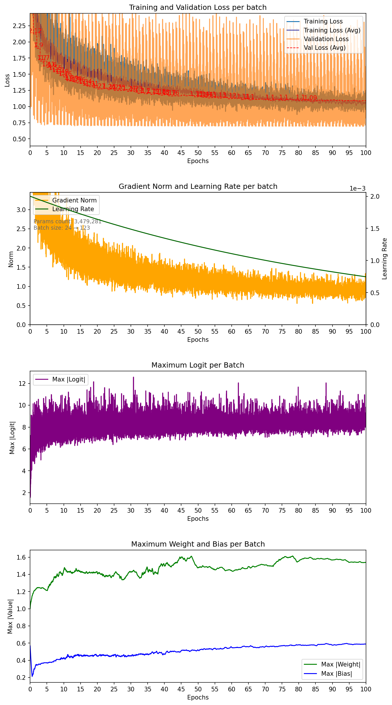

# PointNet ModelNet40 — seed 12

| Metadata | Value |
|---|---|
| Completed | 2026-07-25T20:45:07+02:00 |
| Seed | 12 |
| Parameters | 3,479,281 |
| Epochs | 100 |
| Lowest training batch loss | 0.876637 |
| Training fraction | 1 |
| Validation fraction | 0.1 |
| Batch size | 24 → 123 |
| Average samples/sec | 206.4 |
| Dropout rate | 0.3 |
| Label smoothing | 0.1 |
| Base learning rate | 0.002 |
| Weight decay | 0.0001 |
| LR decay | Smooth x0.8 every 200,000 samples |
| Lowest mean validation loss | 1.085280 |
| Best validation epoch | 83 |

Seed 12 | Test macro F1: 0.7797
Seed 12 | Test accuracy: 0.8476
Test scores: {12: 0.8476499319076538}
