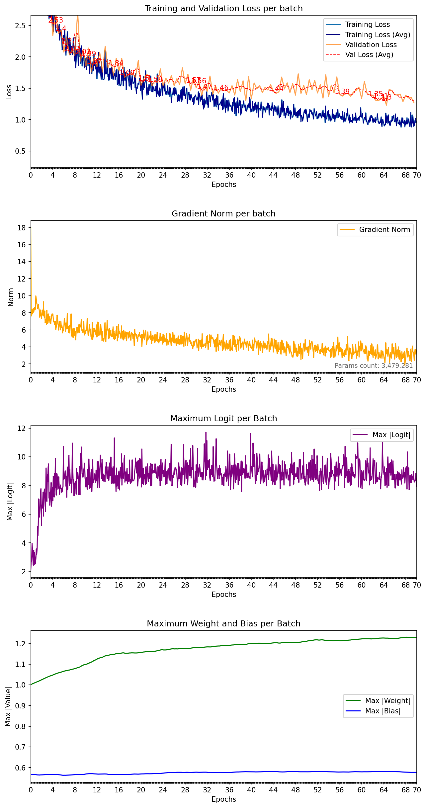

# PointNet ModelNet40 — seed 13

| Metadata | Value |
|---|---|
| Completed | 2026-07-25T08:23:04+02:00 |
| Seed | 13 |
| Parameters | 3,479,281 |
| Epochs | 70 |
| Lowest training batch loss | 0.877959 |
| Training fraction | 0.2 |
| Validation fraction | 0.1 |
| Batch size | 128 |
| Average samples/sec | 211.9 |
| Dropout rate | 0.3 |
| Label smoothing | 0.1 |
| Base learning rate | 0.001 |
| Minimum learning rate | 1e-05 |
| LR decay | x0.7 every 200,000 samples |
| Lowest mean validation loss | 1.302298 |
| Best validation epoch | 64 |
