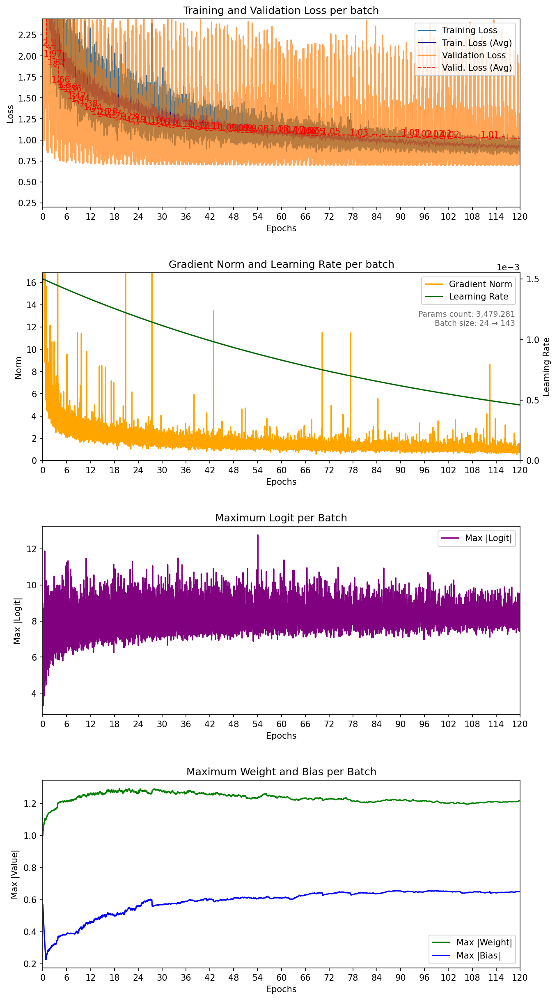
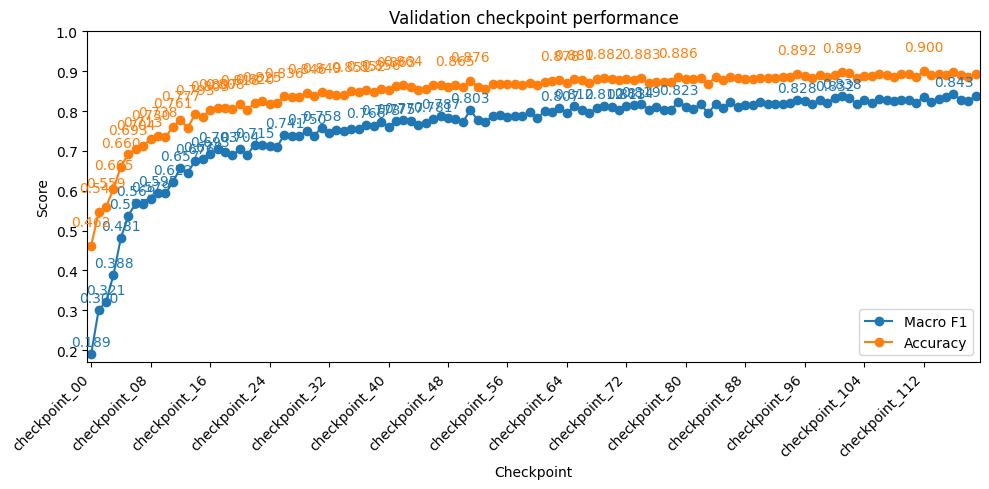

# PointNet ModelNet40 — seed 12

| Metadata | Value |
|---|---|
| Seed | 12 |
| Epochs | 120 |
| Training fraction | 1 |
| Validation fraction | 0.1 |
| Batch size | 24 → 143 |
| Dropout rate | 0.3 |
| Label smoothing | 0.1 |
| Base learning rate | 1.5e-03 |
| LR decay samples | 200,000 |
| LR gamma | 0.8 |
| BNorm decay | 0.5 → 0.99 |
| Weight decay | 1.0e-04 |
| Lowest training batch loss | 0.826033 |
| Lowest mean validation loss | 1.010244 |
| Best validation epoch | 112 |
| Parameters | 3,479,281 |
| Average samples/sec | 66.3 |
| Total training time | 13:13:22 |
| Completed | 2026-07-26T10:09:07+02:00 |

Test macro F1: 0.8059 |
Test accuracy: 0.8667 |
Test scores: {12: 0.8666936755180359}

