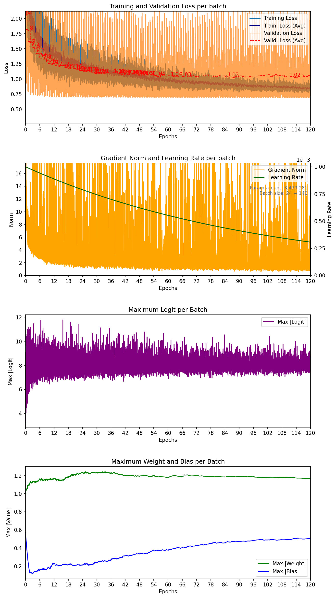
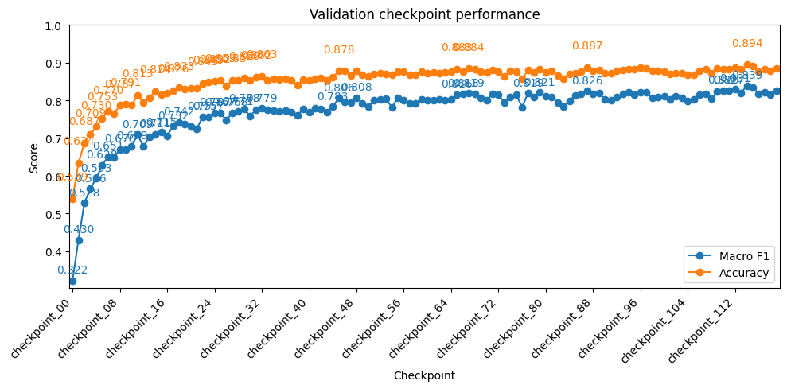

# PointNet ModelNet40 — seed 12 - with the new ortogonalisation of the TNets

| Metadata | Value |
|---|---|
| Seed | 12 |
| Epochs | 120 |
| Training fraction | 1 |
| Validation fraction | 0.1 |
| Batch size | 24 → 143 |
| Dropout rate | 0.3 |
| Label smoothing | 0.1 |
| Base learning rate | 1.0e-03 |
| LR decay samples | 200,000 |
| LR gamma | 0.8 |
| BNorm decay | 0.5 → 0.99 |
| Weight decay | 1.0e-04 |
| Lowest training batch loss | 0.766292 |
| Lowest mean validation loss | 1.022338 |
| Best validation epoch | 113 |
| Parameters | 3,479,281 |
| Average samples/sec | 70.7 |
| Total training time | 04:33:36 |
| Completed | 2026-07-26T17:20:22+02:00 |

Seed 12 | Test macro F1: 0.8061
Seed 12 | Test accuracy: 0.8602
Test scores: {12: 0.8602107167243958}

