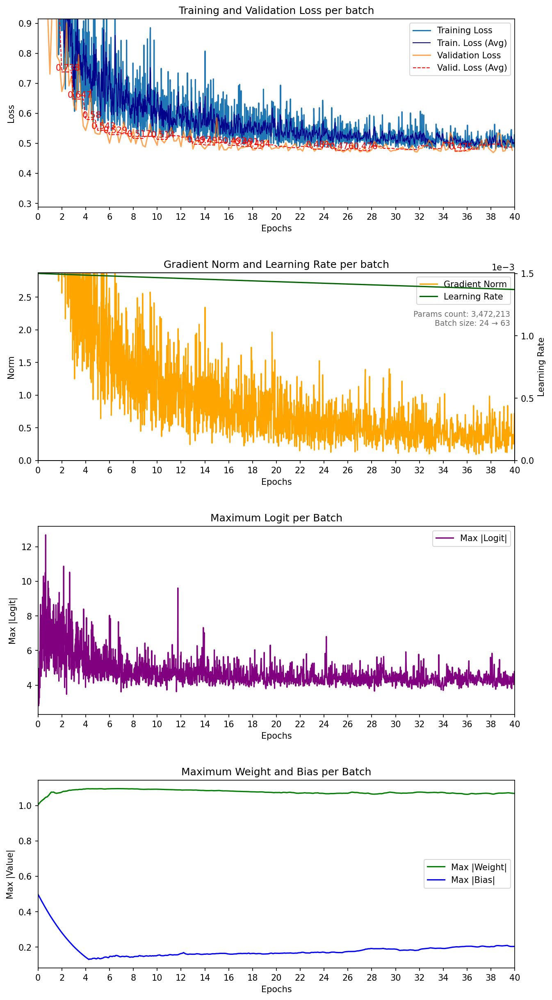

# PointNet RadHAR — seed 1234

| Metadata | Value |
|---|---|
| Seed | 1234 |
| Epochs | 40 |
| Validation fraction | 0.1 |
| Batch size | 24 → 63 |
| Dropout rate | 0.3 |
| Label smoothing | 0.1 |
| Base learning rate | 1.5e-03 |
| LR decay samples | 200,000 |
| LR gamma | 0.8 |
| BNorm decay | 0.5 → 0.01 |
| Weight decay | 1.0e-04 |
| Lowest training batch loss | 0.480376 |
| Lowest mean validation loss | 0.474624 |
| Best validation epoch | 35 |
| Parameters | 3,472,213 |
| Average samples/sec | 29.3 |
| Total training time | 00:47:54 |
| Completed | 2026-07-31T22:57:12+02:00 |
